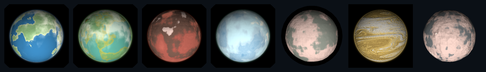
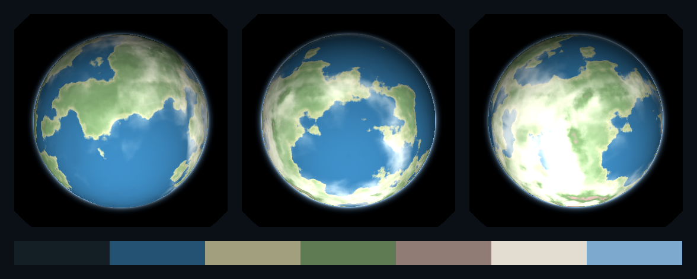
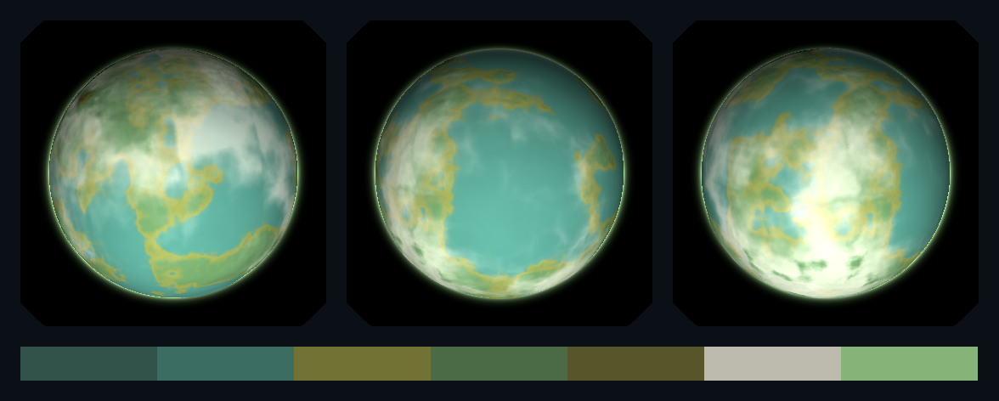
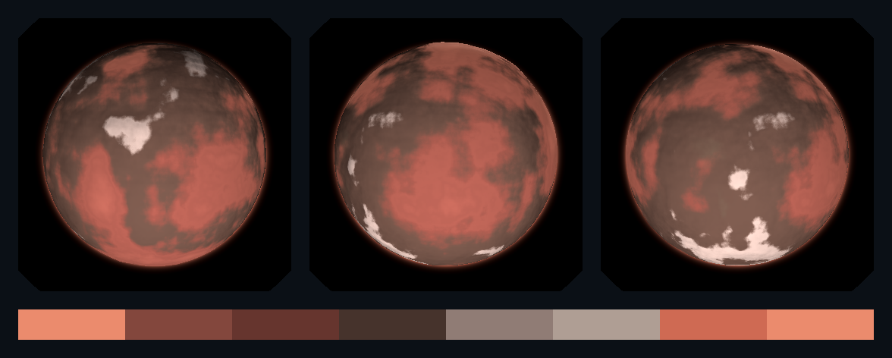
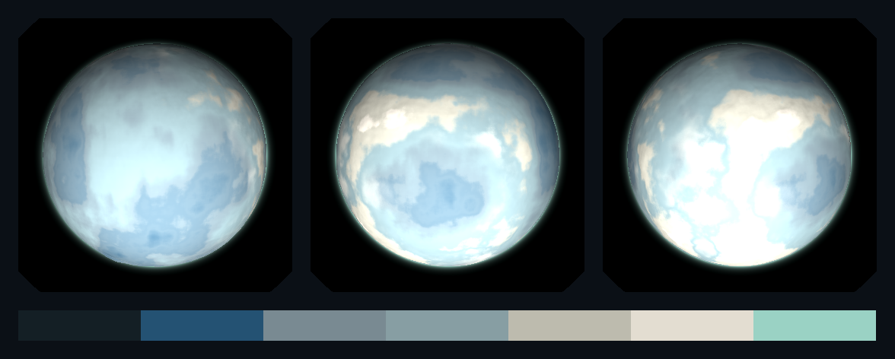
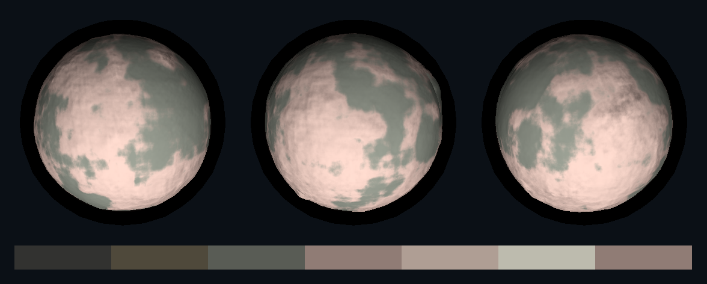
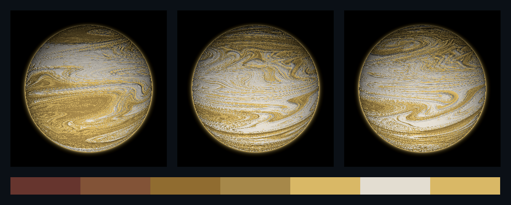
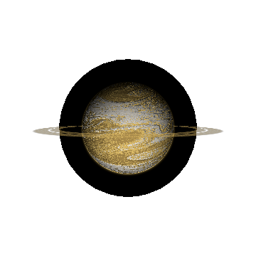
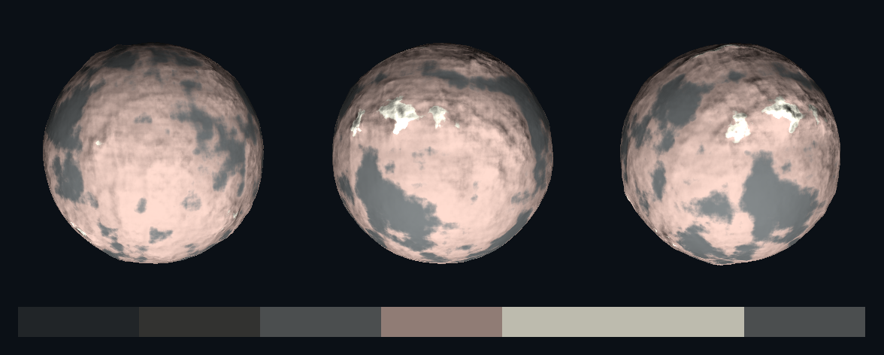

# 15. Worlds

Concept for each kind of world an arena can hold. What the world is, what the
player reads off it in the two seconds they will spend looking at it, what it
does to a ship, and which palette entries it is built from.

Every picture here is the real thing. `tools/shoot_worlds.gd` instances the same
`scenes/terrain/planet.tscn` a battle instances, calls the same `place()`, and
lights it with the rig copied out of `scenes/combat_world.tscn`;
`tools/gen_world_plates.py` arranges the results without resampling them. Run
`./scripts/gen-world-plates.sh` to regenerate the lot. Nothing on this page was
drawn by hand, so a page that disagrees with the game is a bug in the game, not
in the illustration.

How a world is drawn, and where the shader came from, is
[14-reference-planet-shader.md](14-reference-planet-shader.md). What terrain
does to a ship is [13-terrain-and-tractors.md](13-terrain-and-tractors.md)
sections 3 and 4. This document is the concept.

---

## 1. Seven kinds, one of them per battle

Left to right: terran, jungle, volcanic, ice, barren, gas giant, moon.

An arena holds **one** world, plus whatever moons it has caught.
`data/maps.json` gives the High Orbit recipe a count of `[1, 1]` and a moon
count of `[0, 2]`, and the battle seed picks which look the world wears. So a
player who fights ten orbit battles sees ten different systems, one at a time.

**What a world does, whichever one it is.** They are all mechanically identical,
and that is on purpose for now.

| | |
|---|---|
| Body radius | 40 to 55 arena units, drawn per battle |
| Well radius | 160 to 200 arena units |
| Pull | 13.6 units per second at the surface, falling linearly to nothing at the well's edge |
| Hitting it | 45 damage, the heaviest collision in the game (a rock is 12) |

The pull is a velocity the ship acquires rather than a force integrated into its
own, which is what keeps it stable at any timestep and therefore replayable. A
captain who ignores it does not fall out of the sky; they arrive somewhere they
did not steer for, with their firing arcs pointed at nothing.

**A world is data, not code.** Nine colours in `data/palette.json` `worlds` and
twenty two numbers in `data/tuning.json` `terrain_view.planets`. An eighth kind
of world is an entry in those two files plus its name in `data/maps.json`. There
is no new scene and no new script, because one scene and one shader draw all of
them.

| Colour slot | What it paints |
|---|---|
| `abyss` | the deepest water, or on a volcanic world the lava itself |
| `sea` | shallower water |
| `shore` | the coast, the first ground above the waterline |
| `land` | the bulk of the ground |
| `peak` | the highest ground |
| `cap` | the highest ground: snowline, ice sheet, ash. An empty name means the world has none. |
| `cloud` | the weather layer, drawn over everything below it |
| `rim` | the atmosphere, drawn on its own shell past the limb |
| `glow` | ground that keeps its light at night. Empty on every world but the volcanic one. |

| Number | What it changes |
|---|---|
| `terrain_scale`, `noise_strength` | how fine the ground is, and how tall. Strength is calibrated against the levels below: change one and check the other, because at the wrong strength a world is unbroken ocean or unbroken snow. |
| `water_level`, `sand_level`, `tree_level`, `rock_level`, `ice_level` | the altitude each colour takes over at. A level set above what the terrain can reach never appears, which is how a world has no ice. |
| `transition` | how wide the blend between two levels is. Small is a coastline, large is a haze. |
| `clouds_density`, `clouds_scale`, `clouds_speed` | the weather. Density is now literal: 0 is clear sky, 1 is overcast, and the useful band is narrow because the cloud field itself is. A density of 0 skips the layer and its cost entirely. Speed is a drift ACROSS the turning surface, so it is small on purpose: weather that outruns the world it sits on reads as a bug. |
| `atmosphere_density`, `shell` | how thick the air is, and how far past the body its glow reaches. A density of 0 draws no atmosphere at all. |
| `sun_intensity`, `ambient` | how hard the star hits, and how much light the dark side keeps |
| `glow_level` | how much of the lowest ground stays lit at night |
| `relief` | how hard the terrain's own slope bends the normal. **Small numbers.** The height is in units of the planet's radius and is differenced over a step of 0.02, so a value near 1 does not shade a world, it corrugates it. These sit between 0.01 and 0.15. |
| `bands`, `band_x`, `band_y`, `distortion` | the gas giant's belts, read only when `bands` is above 0 |
| `spin` | how fast the world turns |

**Water is the only part of a world that returns a highlight to the star**, so a
world at the right angle carries a sun glint with its own coastlines cut out of
it. Rock has none of it.

**The mountains are real.** The terrain is added to the sphere's radius before
the ray is intersected with it, so a range breaks the silhouette at the limb
rather than being a picture painted on a ball.

**The clouds move**, and they move independently of the ground: the weather is
a domain warped field sampled at an offset that walks with time, over a surface
that is itself turning. Thinned over high ground, so a mountain range is not
buried. This was dead for a while and looked like a missing feature: the
author's coverage threshold is `1 - density * 0.5`, which assumes a cloud field
spanning wider than ours does, so the layer was computed on every fragment of
every world and then thrown away. It is `1 - density` now, which also makes the
number mean what it says.

---

## 2. Terran

**The concept: somebody lives here.** The only world that implies a reason for
the battle. If two fleets are fighting in its well, they are fighting over it.
Nothing in the simulation says so yet, and the art is doing that work alone.

**What it reads as at a glance:** ocean, with continents on it and ice at both
poles. It is the busiest of the four rocky worlds and the one that competes with
the ships for attention, which is the argument for keeping it rare.

`navy` and `blue` water, a `teal_gray` coast, `green` land, `olive_light`
uplands, `cream` caps, `blue_hi` atmosphere. Its sea level is 0.53, the highest
of any world, which is what puts most of the surface under water.

---

## 3. Jungle

**The concept: terran, but further along.** Warmer, wetter, and grown over. The
water is inland rather than oceanic: lakes and river basins in a continuous
canopy rather than continents in a sea.

**What it reads as at a glance:** green, edge to edge, with teal water caught in
the low ground. No ice at all, which is the fastest way to tell it from a terran
world at a distance.

`teal_deep` and `teal` water, `phos_lo` under the canopy, `green` and
`green_light` above it, and a `phos` haze at the limb. Its sea level is 0.42
against terran's 0.53, and it has the finest detail of any world at
`ground_scale` 3.2.

---

## 4. Volcanic

**The concept: a world still cooling.** Dark rock cut by fissures that have not
closed. It is the only world in the game that emits its own light, so it is the
only one with a lit side and a still visible night side.

**What it reads as at a glance:** almost black, with `alert_hi` running through
the low ground. That glow is emissive, so it survives the terminator: a volcanic
world on its night side is a dark disc with orange cracks in it.

`alert_hi` in the deepest ground, `clay` on the cooling crust, `clay_deep` and
`bark` rock, `taupe_deep` ash on the peaks, `alert` at the limb. Its sea level is
0.30, so most of it is rock and the lava is confined to the lowest third. The
lava is also the smoothest ground on it, which gives the fissures a wet sheen
that dry rock does not have.

---

## 5. Ice

**The concept: a world that used to be terran, or never quite got there.** The
sheet reaches almost to the equator and the sea shows through where it has not
closed over.

**What it reads as at a glance:** bright and cold, mostly one value. A hull
crossing in front of it is a dark shape on white, which is the clearest read in
the game.

`navy_deep` and `blue` water, `gray_blue` and `gray_blue_light` ice, `cream` at
the top and for the caps, `shield_hi` at the limb. Its `cap_start` is 0.42
against terran's 0.80, which is what brings the ice down to the tropics.

---

## 6. Barren

**The concept: nothing happened here and nothing will.** No air worth the name,
so the limb is nearly unlit: `rim_brightness` 0.45 where every other world is
above 1.0, and that one number is what makes it read as airless.

**What it reads as at a glance:** a rock. `char` through `taupe`, no hue in it
anywhere. The only world with no bright value, so it recedes rather than
competing, which makes it the right default for a fight about something other
than the planet.

---

## 7. Gas giant

**The concept: the one world that is unmistakably not a place to land.**

It is the only world with `bands` at 1, which is what puts it on a different
surface generator from every other world: the vendored whorley flow field rather
than our continent noise. Warm where every other world is cool: `clay_deep` in
the deep belts, `bronze`, `gold_deep`, `gold` and `gold_hi` above them.

**The ring is a committed mesh, not part of the shader.**
`assets/meshes/planet_ring.obj`, a flat annulus written by `tools/gen_meshes.py`
like every other mesh, tilted in the scene and scaled by `terrain_view.ring_span`
to nearly twice the body's radius. It takes its colour from the world's `land`
role and its transparency from the scene, and no other world shows one.

**The ring is drawn by its own shader** (`assets/shaders/planet_ring.gdshader`,
ours rather than vendored). It reads the same 3D noise field the planet does,
sampled along one axis only, so it comes out as concentric bands rather than
blotches; it has one division swept clear through it; and the world casts a
shadow across it, which is the only cue that says where the star is when the
planet's own terminator is off screen. Which worlds have a ring is the `ring`
colour role in `data/palette.json`: name a colour and the world has one.

**The ring still does nothing.** The simulation knows about the body and the
well, and nothing else. A ship flies through it with no effect, which is the one
place on this page where the art promises something the rules do not deliver.
Section 9 has the options.

---

## 8. Moons

**The concept: something the world caught.** A moon is not decoration painted
into the scene: `src/sim/terrain.gd` places it, so it is solid, it collides for
the same damage the world does, and a replay puts it in the same place.

**A moon is a planet with no well.** Same feature kind, same collision rule,
same scene, and a field radius of zero, which is exactly what `pull_at()` reads
as "this one does not tug". That is deliberately not a second kind of feature:
one code path, one answer to what happens when a hull touches it.

Between zero and two per world, at 16 to 30 percent of its radius, sitting
between 45 and 85 percent of the way out to the edge of its well. All of that is
in the High Orbit recipe in `data/maps.json`. They keep clear of the starting
positions and of each other, using the same acceptance test every solid body
uses.

`ink` and `char` in the crater floors, `gunmetal` and `taupe_deep` on the
ground, `bone` on the ridges. It is the finest surface in the game at
`ground_scale` 4.2, and its `rim_brightness` of 0.15 is the lowest, because a
moon has no atmosphere at all.

**Nothing orbits.** The arena is a still frame: a moon is placed once at a
bearing drawn from the battle seed and stays there, like every rock in the
belt. Moving them would put the view and the simulation in disagreement about
where a solid body is, which is the one thing terrain must never do.

---

## 9. The bug that ate a world, and what it was

For a while one world in the tactical view rendered as an absent disc: its
gravity well ring and its atmosphere glow present, its body missing. It is
written down here because the cause is a trap that will be laid again.

**A scene sub resource is shared by every instance of that scene** unless it is
marked local to it. All three of a world's materials were sub resources of
`scenes/terrain/planet.tscn`, so every world in an arena wrote its radius and
its colours into the same material and the last one placed won. Moons are placed
after the world they belong to, so a gas giant beside a moon was drawn at the
moon's radius: a body a fifth the size it should be, at tactical range, inside
its own correctly sized ring. It looked exactly like a world that had failed to
render, which is why it took so long to see.

Two things came out of it. `resource_local_to_scene = true` on the three
materials, with a comment in the scene saying why. And a test,
`test_planet_materials` in `tests/run_tests.gd`, that places a world and a moon
and asserts they do not share a material and each kept its own radius.

The noise texture is deliberately NOT local: one field shared by every world is
the whole point of it.

A second bug was found on the way and is worth the same note. The body writes
`ALPHA`, and writing `ALPHA` at all puts a Godot material in the transparent
queue, where it does not write depth and is sorted against other transparents by
object origin. A world and its own atmosphere shell share an origin, so that
sort was a coin toss. An `ALPHA_SCISSOR_THRESHOLD` makes the material opaque
again.

---

## 10. What is not built

**Looks carry no rules.** Every world pulls and kills identically, so the
variant is decoration. The obvious next step is to let each one bend one number:
a gas giant with a wider, weaker well; a barren rock with a tighter, sharper
one; a volcanic world that damages a hull sitting too close. That is a
`data/maps.json` change and a `Terrain` change, not an art change, and it wants
its own design pass rather than an implementer's guess.

**The ring does nothing.** Either it should grind like an asteroid halo, using
the rule that already exists, or the gas giant should be drawn without one.
Drawing a hazard that is not a hazard teaches a player the wrong thing.

**Moons do not move and have no wells.** Both are defensible now and both are
the first things to revisit if the orbit map ever needs more than one gravity
well to think about.

**An arena holds one world.** Two would give a captain a choice of wells to
fight in, which is a genuinely different map rather than the same map twice.
