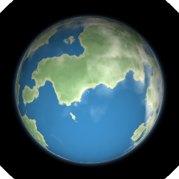
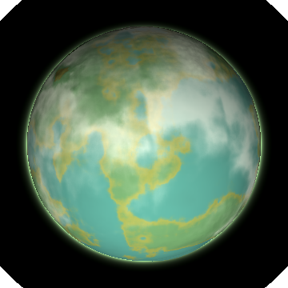
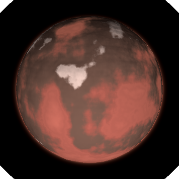
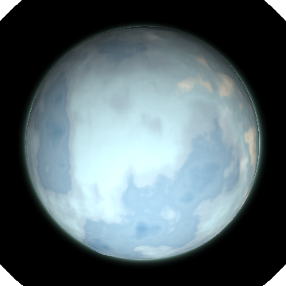
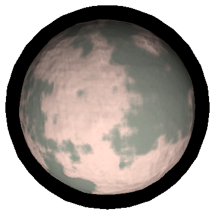
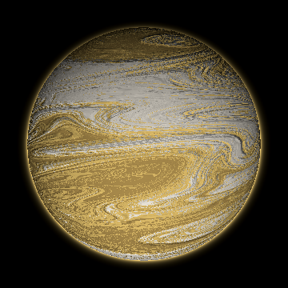
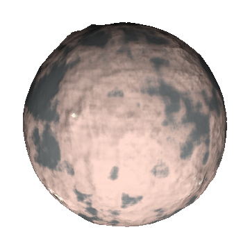

# Planets

Every kind of world an arena can hold. **This file is generated**: run `./scripts/gen-world-plates.sh`, which renders each world through the same scene a battle uses and rewrites the table below. Do not hand edit it.

The concept behind each one, and what a world does to a ship, is [docs/15-worlds.md](docs/15-worlds.md). How they are drawn, and why this game is GPL-3.0, is [docs/14-reference-planet-shader.md](docs/14-reference-planet-shader.md).

| | World | What it is |
|---|---|---|
|  | **terran** | Somebody lives here. The only world that implies a reason for the battle: ocean, continents, ice at both poles. |
|  | **jungle** | Terran, further along. Canopy edge to edge with the water caught inland, and no ice at all, which is how you tell them apart. |
|  | **volcanic** | Still cooling. Dark rock cut by fissures that have not closed, and the only world that keeps its own light at night. |
|  | **ice** | Terran once, or never quite. The sheet reaches the tropics and the sea shows through where it has not closed over. |
|  | **barren** | Nothing happened here and nothing will. Airless, so its limb is a hard edge with no haze on it. |
|  | **gas** | Not a place to land. Belts all the way down, and the only world with a ring. |
|  | **moon** | Something a world caught. Solid, and it collides like one, but it has no well of its own. |

## What each one has

| World | Air | Cloud | Ice | Night glow | Ring | Belts |
|---|---|---|---|---|---|---|
| terran | yes | yes | yes | none | none | none |
| jungle | yes | yes | none | none | none | none |
| volcanic | yes | yes | none | yes | none | none |
| ice | yes | yes | yes | none | none | none |
| barren | yes | none | none | none | none | none |
| gas | yes | none | none | none | yes | yes |
| moon | none | none | none | none | none | none |

## What each one is made of

Palette roles from `data/palette.json`, lowest ground first. An empty cell means the world has none of that thing.

| World | `abyss` | `sea` | `shore` | `land` | `peak` | `cap` | `rim` | `glow` |
|---|---|---|---|---|---|---|---|---|
| terran | `navy_deep` | `blue` | `olive_light` | `green` | `taupe_deep` | `cream` | `blue_hi` |  |
| jungle | `teal_deep` | `teal` | `moss_light` | `phos_lo` | `moss_deep` | `bone` | `phos` |  |
| volcanic | `alert_hi` | `clay` | `clay_deep` | `bark` | `taupe_deep` | `taupe` | `alert` | `alert_hi` |
| ice | `navy_deep` | `blue` | `gray_blue` | `gray_blue_light` | `bone` | `cream` | `shield_hi` |  |
| barren | `char` | `drab_deep` | `moss_gray` | `taupe_deep` | `taupe` | `bone` | `taupe_deep` |  |
| gas | `clay_deep` | `bronze` | `gold_deep` | `gold` | `gold_hi` | `cream` | `gold_hi` |  |
| moon | `ink` | `char` | `gunmetal` | `taupe_deep` | `bone` | `bone` | `gunmetal` |  |
